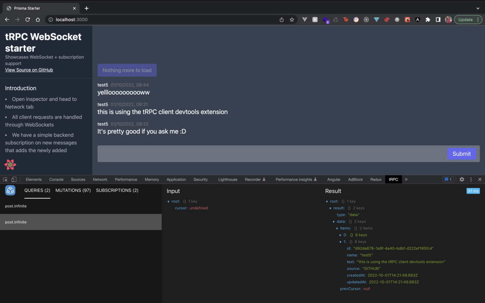

# tRPC Client Devtools

# Installation

1. Install the [trpc-client-devtools-link](https://www.npmjs.com/package/trpc-client-devtools-link) npm package and add it to your tRPC client config (if you're using tRPC v10, install the @next version)
2. Download and install the tRPC Client Devtools Browser Extension for [Chrome](https://chrome.google.com/webstore/detail/trpc-client-devtools/ocolkjnalnkdaclepjmkigefcgngkadb?hl=en&authuser=1) or [Firefox](https://addons.mozilla.org/en-US/firefox/addon/trpc-client-devtools/)
3. Open the Devtools, navigate to the tRPC panel and inspect away!

# Features

The tRPC Client Devtools appear as a "tRPC" tab in your web browser inspector when tRPC is detected, alongside other tabs like "Elements" and "Console". The devtools currently have 3 main features:

- **Query inspector:** View the input, result and elapsed time of the fired queries.
- **Mutation inspector:** View the input, result and elapsed time of the fired mutations.
- **Subscription inspector:** View the input, multiple results and their elapsed time of the subscriptions.

